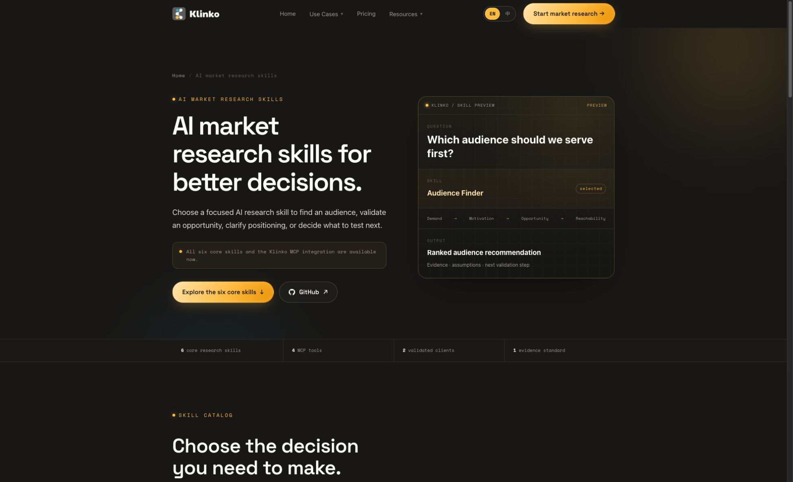

<div align="center">
  <h1>Klinko AI Market Research Skills</h1>
  <p><strong>AI market research for audience analysis, market opportunity discovery, and validation in Codex and Claude Code.</strong></p>
  <p>
    <a href="./README.md">🇺🇸 English</a> ·
    <a href="./README.zh-CN.md">🇨🇳 简体中文</a> ·
    <a href="./README.zh-TW.md">🇭🇰 繁體中文</a>
  </p>
  <p>
    <a href="#six-core-market-research-skills">🌐 Explore the Skills</a> ·
    <a href="https://github.com/klinkoai">🏢 Organization</a> ·
    <a href="https://home.klinko.ai">🚀 Start Market Research</a>
  </p>
</div>

Klinko is an **AI market research tool** and Audience Decision Engine for founders, product teams, product marketers, and growth teams. It turns public market signals into a prioritized decision: **who to serve, what they need, where the opportunity is, and what to validate next**. Use the six focused Skills below directly in Codex or Claude Code through the authenticated Klinko MCP connection.

## Install with one prompt

Copy this into Codex or Claude Code:

```text
Install Klinko AI Market Research Skills from https://github.com/klinkoai/ai-market-research-skills for this client. Read the repository instructions before changing anything, preserve my existing Skills and MCP configuration, and connect the authenticated Klinko MCP server at user level with my own API key. Never ask me to paste the key into chat, never print it, and never write it into a project or Git repository. Verify match_submit, match_get, circle_knowledge, and persona_knowledge, then report what was configured and which market research skills are available.
```

An authorized Klinko API key is required for live research. See the [Codex guide](./docs/codex.md), [Claude Code guide](./docs/claude-code.md), and [authentication notes](./docs/authentication.md).

## How Klinko market research works

1. Start with a decision question about an audience, customer problem, market opportunity, startup idea, position, or content direction.
2. Klinko organizes relevant public market signals through its authenticated MCP runtime.
3. The selected Skill separates evidence, interpretation, contradictions, and uncertainty before ranking the available options.
4. The result ends with one practical validation step instead of presenting an unsupported market verdict.

## Website preview



Open a focused Skill below or visit the [Klinko Skill catalog](https://klinko.ai/en/skills/).

## Six core market research skills

Klinko focuses its public catalog on six distinct, high-value market decisions. Each skill defines focused inputs, evaluation criteria, evidence boundaries, outputs, and a next validation step.

Install from this repository. The six focused repositories below are public capability pages with decision-specific examples, FAQs, and evidence boundaries.

| Skill | Decision it supports | Repository | Guide |
| --- | --- | --- | --- |
| **Audience Finder** | Which audience should we serve first? | [GitHub](https://github.com/klinkoai/klinko-audience-finder) | [Open guide](./references/workflow-audience-finder.md) |
| **Customer Pain Point Analyst** | Which recurring problem creates meaningful demand? | [GitHub](https://github.com/klinkoai/klinko-customer-pain-point-analyst) | [Open guide](./references/workflow-customer-pain-point-analyst.md) |
| **Market Opportunity Analyst** | Which market opportunity deserves validation first? | [GitHub](https://github.com/klinkoai/klinko-market-opportunity-analyst) | [Open guide](./references/workflow-market-opportunity-analyst.md) |
| **Startup Idea Validator** | Which assumption could invalidate the idea? | [GitHub](https://github.com/klinkoai/klinko-startup-idea-validator) | [Open guide](./references/workflow-startup-idea-validator.md) |
| **Positioning Strategist** | What position and message are worth testing? | [GitHub](https://github.com/klinkoai/klinko-positioning-strategist) | [Open guide](./references/workflow-positioning-strategist.md) |
| **Content Strategy Builder** | Which content themes, formats, and channels deserve priority? | [GitHub](https://github.com/klinkoai/klinko-content-strategy-builder) | [Open guide](./references/workflow-content-strategy-builder.md) |

<table>
  <tr>
    <td width="33%"><a href="https://github.com/klinkoai/klinko-audience-finder"><br><strong>Audience Finder</strong></a></td>
    <td width="33%"><a href="https://github.com/klinkoai/klinko-customer-pain-point-analyst"><br><strong>Customer Pain Point Analyst</strong></a></td>
    <td width="33%"><a href="https://github.com/klinkoai/klinko-market-opportunity-analyst"><br><strong>Market Opportunity Analyst</strong></a></td>
  </tr>
  <tr>
    <td width="33%"><a href="https://github.com/klinkoai/klinko-startup-idea-validator"><br><strong>Startup Idea Validator</strong></a></td>
    <td width="33%"><a href="https://github.com/klinkoai/klinko-positioning-strategist"><br><strong>Positioning Strategist</strong></a></td>
    <td width="33%"><a href="https://github.com/klinkoai/klinko-content-strategy-builder"><br><strong>Content Strategy Builder</strong></a></td>
  </tr>
</table>

## Example prompts

### Audience research

```text
Use $klinko-market-research to find and rank the audience segments most worth serving for an AI meeting assistant built for small remote teams in the United States. Include where the leading segments can be reached and the next validation step.
```

### Market validation

```text
Use $klinko-market-research to identify the riskiest assumption in this startup idea, evaluate the available market evidence, and design the smallest credible test before we build.
```

### Positioning

```text
Use $klinko-market-research to turn this audience evidence, current alternatives, and customer language into a clear positioning direction with proof requirements and a testable message.
```

## Package structure

```text
ai-market-research-skills/
├── SKILL.md                     # entry point and shared execution rules
├── agents/openai.yaml           # user-facing Skill definition
├── references/
│   ├── mcp-setup.md
│   ├── mcp-tools.md
│   └── workflow-*.md            # focused research instructions
└── docs/                        # client setup and security documentation
```

## Supported clients

- [Codex CLI and desktop app](./docs/codex.md) — validated
- [Claude Code](./docs/claude-code.md) — validated

The MCP runtime exposes `match_submit`, `match_get`, `circle_knowledge`, and `persona_knowledge`. All six core skills and the authenticated runtime are complete.

## Documentation

- [Connect Klinko MCP in Codex](./docs/codex.md)
- [Connect Klinko MCP in Claude Code](./docs/claude-code.md)
- [Authentication](./docs/authentication.md)
- [MCP runtime overview](./docs/api-overview.md)
- [Machine-readable catalog](./catalog.json)
- [Security policy](./SECURITY.md)

## Research and trust

- [Research methodology](https://klinko.ai/en/research-methodology/) — sources, evidence handling, limitations, and update standards
- [About Klinko Research](https://klinko.ai/en/about/) — publisher, editorial standards, corrections, and company information

## Contact

[business@klinko.ai](mailto:business@klinko.ai)

Maintained by [Klinko](https://github.com/klinkoai) · Updated August 9, 2026
