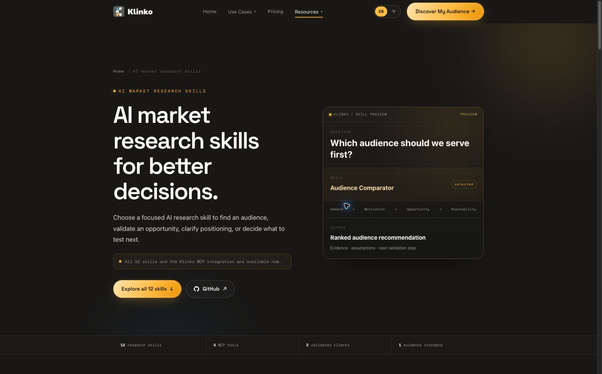

<div align="center">
  <h1>Klinko AI Market Research Skills</h1>
  <p><strong>12 evidence-led skills for audience research, market validation, positioning, content, and growth decisions.</strong></p>
  <p>
    <a href="./README.md">🇺🇸 English</a> ·
    <a href="./README.zh-CN.md">🇨🇳 简体中文</a> ·
    <a href="./README.zh-TW.md">🇭🇰 繁體中文</a>
  </p>
  <p>
    <a href="https://klinko.ai/en/skills/">🌐 Explore all skills</a> ·
    <a href="https://github.com/klinkoai">🏢 Organization</a> ·
    <a href="https://home.klinko.ai">🚀 Start Market Research</a>
  </p>
</div>

## Install with one prompt

Copy this into Codex or Claude Code:

```text
Install Klinko AI Market Research Skills from https://github.com/klinkoai/ai-market-research-skills for this client. Read the repository instructions before changing anything, preserve my existing Skills and MCP configuration, and connect the authenticated Klinko MCP server at user level with my own API key. Never ask me to paste the key into chat, never print it, and never write it into a project or Git repository. Verify match_submit, match_get, circle_knowledge, and persona_knowledge, then report what was configured and which market research skills are available.
```

An authorized Klinko API key is required for live research. See the [Codex guide](./docs/codex.md), [Claude Code guide](./docs/claude-code.md), and [authentication notes](./docs/authentication.md).

## Website preview




## 12 market research skills

Choose the skill that matches the decision in front of you. Each skill defines focused inputs, evaluation criteria, evidence boundaries, outputs, and a next validation step.

| Skill | Decision it supports |
| --- | --- |
| [Audience Finder](./references/workflow-audience-finder.md) | Which audience should we investigate first? |
| [Niche Audience Discovery](./references/workflow-niche-audience-discovery.md) | Which overlooked niche is coherent and underserved? |
| [Audience Comparator](./references/workflow-audience-comparator.md) | Which candidate audience is the stronger choice? |
| [Market Opportunity Analyst](./references/workflow-market-opportunity-analyst.md) | Which market opportunity deserves validation first? |
| [Startup Idea Validator](./references/workflow-startup-idea-validator.md) | Which assumption could invalidate the idea? |
| [Early Adopter Finder](./references/workflow-early-adopter-finder.md) | Who is most likely to try the offer first? |
| [Buyer Persona Builder](./references/workflow-buyer-persona-builder.md) | What drives the selected audience's buying behavior? |
| [Customer Pain Point Analyst](./references/workflow-customer-pain-point-analyst.md) | Which recurring problem creates meaningful demand? |
| [Positioning Strategist](./references/workflow-positioning-strategist.md) | What position and message are worth testing? |
| [Content Strategy Builder](./references/workflow-content-strategy-builder.md) | Which content themes and channels deserve priority? |
| [Creative Brief Generator](./references/workflow-creative-brief-generator.md) | How should evidence become an execution-ready brief? |
| [Viral Pattern Analyzer](./references/workflow-viral-pattern-analyzer.md) | Which content mechanisms appear repeatable? |

Each skill also has a focused public page under [github.com/klinkoai](https://github.com/klinkoai) and on [klinko.ai](https://klinko.ai/en/skills/), with examples, limitations, and related research decisions.

## Package structure

```text
ai-market-research-skills/
├── SKILL.md                     # entry point and shared execution rules
├── agents/openai.yaml           # user-facing Skill definition
├── references/
│   ├── mcp-setup.md
│   ├── mcp-tools.md
│   └── workflow-*.md            # focused research instructions
└── docs/                        # client setup and security documentation
```

## Supported clients

- [Codex CLI and desktop app](./docs/codex.md) — validated
- [Claude Code](./docs/claude-code.md) — validated

The MCP runtime exposes `match_submit`, `match_get`, `circle_knowledge`, and `persona_knowledge`. All 12 skills and the authenticated runtime are complete.

## Documentation

- [Connect Klinko MCP in Codex](./docs/codex.md)
- [Connect Klinko MCP in Claude Code](./docs/claude-code.md)
- [Authentication](./docs/authentication.md)
- [MCP runtime overview](./docs/api-overview.md)
- [Machine-readable catalog](./catalog.json)
- [Security policy](./SECURITY.md)

## Contact

[business@klinko.ai](mailto:business@klinko.ai)
