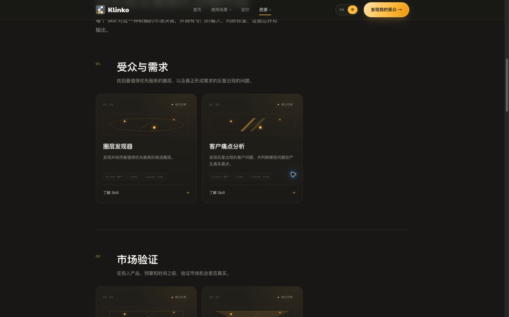
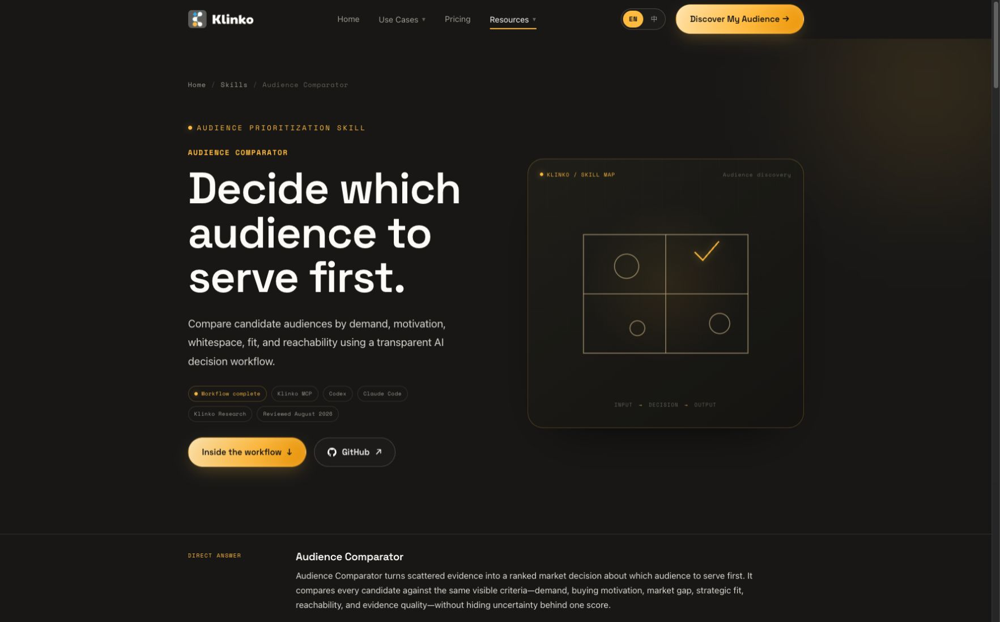

<div align="center">
  <h1>Klinko AI 市场研究 Skills</h1>
  <p><strong>12 个证据驱动的 Skills，覆盖圈层研究、市场验证、定位、内容与增长决策。</strong></p>
  <p>
    <a href="./README.md">🇺🇸 English</a> ·
    <a href="./README.zh-CN.md">🇨🇳 简体中文</a> ·
    <a href="./README.zh-TW.md">🇭🇰 繁體中文</a>
  </p>
  <p>
    <a href="https://klinko.ai/zh/skills/">🌐 浏览全部 Skills</a> ·
    <a href="https://github.com/klinkoai">🏢 GitHub Organization</a> ·
    <a href="https://home.klinko.ai">🚀 开始市场研究</a>
  </p>
</div>

## 用一句提示词安装

把下面这段提示词复制到 Codex 或 Claude Code：

```text
请从 https://github.com/klinkoai/ai-market-research-skills 为当前客户端安装 Klinko AI 市场研究 Skills。修改配置前先阅读仓库说明，保留我已有的 Skills 和 MCP 配置，并使用我自己的 API Key 在用户级接入带鉴权的 Klinko MCP。不要让我把 Key 发到聊天里，不要显示或记录 Key，也不要把 Key 写入项目或 Git。验证 match_submit、match_get、circle_knowledge 和 persona_knowledge 四个工具，然后说明完成了哪些配置以及目前可以使用哪些市场研究 Skills。
```

真实研究需要已授权的 Klinko API Key。手动配置请查看 [Codex 接入文档](./docs/codex.md)、[Claude Code 接入文档](./docs/claude-code.md)和[身份验证说明](./docs/authentication.md)。

## 网站预览





## 12 个市场研究 Skills

根据眼前需要做出的决定选择对应 Skill。每个 Skill 都定义了专门的输入、判断标准、证据边界、输出和下一步验证。

| Skill | 支持的决策 |
| --- | --- |
| [圈层发现器](https://klinko.ai/zh/skills/audience-finder/) · [研究说明](./references/workflow-audience-finder.md) | 应该先研究哪个圈层？ |
| [细分圈层发现](https://klinko.ai/zh/skills/niche-audience-discovery/) · [研究说明](./references/workflow-niche-audience-discovery.md) | 哪个被忽略的细分市场真实且未被满足？ |
| [圈层对比器](https://klinko.ai/zh/skills/audience-comparator/) · [研究说明](./references/workflow-audience-comparator.md) | 多个候选圈层中应该优先选择谁？ |
| [市场机会分析](https://klinko.ai/zh/skills/market-opportunity-analyst/) · [研究说明](./references/workflow-market-opportunity-analyst.md) | 哪个市场机会最值得先验证？ |
| [创业想法验证](https://klinko.ai/zh/skills/startup-idea-validator/) · [研究说明](./references/workflow-startup-idea-validator.md) | 哪项关键假设可能让想法失败？ |
| [早期采用者发现](https://klinko.ai/zh/skills/early-adopter-finder/) · [研究说明](./references/workflow-early-adopter-finder.md) | 谁最可能率先尝试产品？ |
| [买家画像构建器](https://klinko.ai/zh/skills/buyer-persona-builder/) · [研究说明](./references/workflow-buyer-persona-builder.md) | 什么因素推动选定圈层购买？ |
| [客户痛点分析](https://klinko.ai/zh/skills/customer-pain-point-analyst/) · [研究说明](./references/workflow-customer-pain-point-analyst.md) | 哪个重复问题正在形成真实需求？ |
| [定位策略](https://klinko.ai/zh/skills/positioning-strategist/) · [研究说明](./references/workflow-positioning-strategist.md) | 什么定位和信息值得测试？ |
| [内容策略构建](https://klinko.ai/zh/skills/content-strategy-builder/) · [研究说明](./references/workflow-content-strategy-builder.md) | 哪些主题、形式和渠道应优先投入？ |
| [创意简报生成](https://klinko.ai/zh/skills/creative-brief-generator/) · [研究说明](./references/workflow-creative-brief-generator.md) | 如何把证据转化为可执行创意简报？ |
| [传播模式分析](https://klinko.ai/zh/skills/viral-pattern-analyzer/) · [研究说明](./references/workflow-viral-pattern-analyzer.md) | 哪些内容机制可能重复？ |

每个 Skill 都在 [github.com/klinkoai](https://github.com/klinkoai) 与 [klinko.ai](https://klinko.ai/zh/skills/) 拥有独立介绍页，包含示例、能力边界和相关研究决策。

## 安装包结构

```text
ai-market-research-skills/
├── SKILL.md                     # 入口与通用执行规则
├── agents/openai.yaml           # 面向用户的 Skill 定义
├── references/
│   ├── mcp-setup.md
│   ├── mcp-tools.md
│   └── workflow-*.md            # 专门的研究说明
└── docs/                        # 客户端接入和安全文档
```

## 支持客户端

- [Codex CLI 与桌面 App](./docs/codex.md) — 已验证
- [Claude Code](./docs/claude-code.md) — 已验证

MCP 运行层提供 `match_submit`、`match_get`、`circle_knowledge` 和 `persona_knowledge`。12 个 Skills 与鉴权运行层均已完成。

## 文档

- [在 Codex 中连接 Klinko MCP](./docs/codex.md)
- [在 Claude Code 中连接 Klinko MCP](./docs/claude-code.md)
- [身份验证](./docs/authentication.md)
- [MCP 运行层概览](./docs/api-overview.md)
- [机器可读目录](./catalog.json)
- [安全政策](./SECURITY.md)

## 联系我们

[business@klinko.ai](mailto:business@klinko.ai)
