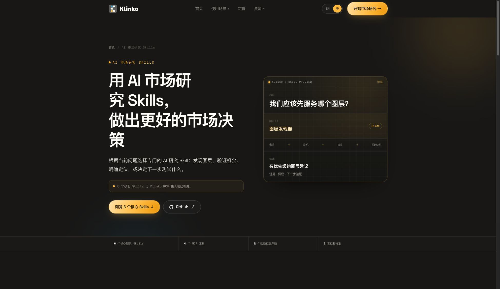

<div align="center">
  <h1>Klinko AI 市场研究 Skills</h1>
  <p><strong>直接在 Codex 和 Claude Code 中完成目标用户分析、市场机会发现与验证。</strong></p>
  <p>
    <a href="./README.md">🇺🇸 English</a> ·
    <a href="./README.zh-CN.md">🇨🇳 简体中文</a> ·
    <a href="./README.zh-TW.md">🇭🇰 繁體中文</a>
  </p>
  <p>
    <a href="#6-个核心市场研究-skills">🌐 浏览 Skills</a> ·
    <a href="https://github.com/klinkoai">🏢 GitHub Organization</a> ·
    <a href="https://home.klinko.ai">🚀 开始市场研究</a>
  </p>
</div>

Klinko 是一款 **AI 市场调研工具**，也是一套持续更新的圈层决策引擎，面向创业者、产品团队、产品营销与增长团队。它把公开市场信号转化为有优先级的市场决定：**应该先服务哪类目标用户、他们需要什么、市场机会在哪里，以及下一步验证什么**。连接带鉴权的 Klinko MCP 后，可直接在 Codex 或 Claude Code 中使用下面 6 个市场研究 Skills。

## 用一句提示词安装

把下面这段提示词复制到 Codex 或 Claude Code：

```text
请从 https://github.com/klinkoai/ai-market-research-skills 为当前客户端安装 Klinko AI 市场研究 Skills。修改配置前先阅读仓库说明，保留我已有的 Skills 和 MCP 配置，并使用我自己的 API Key 在用户级接入带鉴权的 Klinko MCP。不要让我把 Key 发到聊天里，不要显示或记录 Key，也不要把 Key 写入项目或 Git。验证 match_submit、match_get、circle_knowledge 和 persona_knowledge 四个工具，然后说明完成了哪些配置以及目前可以使用哪些市场研究 Skills。
```

真实研究需要已授权的 Klinko API Key。手动配置请查看 [Codex 接入文档](./docs/codex.md)、[Claude Code 接入文档](./docs/claude-code.md)和[身份验证说明](./docs/authentication.md)。

## Klinko 如何进行市场调研

1. 先提出一个有关目标用户、客户痛点、市场机会、创业想法、产品定位或内容方向的决策问题。
2. Klinko 通过带鉴权的 MCP 运行层整理相关公开市场信号。
3. 对应的 Skill 会在排序之前区分证据、解释、反例与不确定性。
4. 结果以一个可执行的验证步骤结束，而不是给出缺少证据的市场结论。

## 网站预览



直接打开下面的专门 Skill 说明，或访问 [Klinko 中文 Skill 目录](https://klinko.ai/zh/skills/)。

## 6 个核心市场研究 Skills

Klinko 将公开目录聚焦到 6 个边界清晰、价值最高的市场决策。每个 Skill 都定义了专门的输入、判断标准、证据边界、输出和下一步验证。

请从当前主仓库安装。下面 6 个独立仓库是面向各项能力的公开介绍页，分别提供决策示例、FAQ 与证据边界。

| Skill | 支持的决策 | 独立仓库 | 详细说明 |
| --- | --- | --- | --- |
| **圈层发现器** | 应该先服务哪个圈层？ | [GitHub](https://github.com/klinkoai/klinko-audience-finder) | [打开说明](./references/workflow-audience-finder.md) |
| **客户痛点分析** | 哪个重复问题正在形成真实需求？ | [GitHub](https://github.com/klinkoai/klinko-customer-pain-point-analyst) | [打开说明](./references/workflow-customer-pain-point-analyst.md) |
| **市场机会分析** | 哪个市场机会最值得先验证？ | [GitHub](https://github.com/klinkoai/klinko-market-opportunity-analyst) | [打开说明](./references/workflow-market-opportunity-analyst.md) |
| **创业想法验证** | 哪项关键假设可能让想法失败？ | [GitHub](https://github.com/klinkoai/klinko-startup-idea-validator) | [打开说明](./references/workflow-startup-idea-validator.md) |
| **定位策略** | 什么定位和信息值得测试？ | [GitHub](https://github.com/klinkoai/klinko-positioning-strategist) | [打开说明](./references/workflow-positioning-strategist.md) |
| **内容策略构建** | 哪些主题、形式和渠道应优先投入？ | [GitHub](https://github.com/klinkoai/klinko-content-strategy-builder) | [打开说明](./references/workflow-content-strategy-builder.md) |

## 示例提示词

```text
使用 $klinko-market-research，为一款面向美国远程小团队的 AI 会议助手寻找并排序最值得优先服务的用户圈层，并说明可以通过哪些渠道触达领先圈层，以及下一步应验证什么。
```

```text
使用 $klinko-market-research，找出这个创业想法最危险的假设，用已有市场证据进行评估，并设计开发前最小、可信的验证测试。
```

## 安装包结构

```text
ai-market-research-skills/
├── SKILL.md                     # 入口与通用执行规则
├── agents/openai.yaml           # 面向用户的 Skill 定义
├── references/
│   ├── mcp-setup.md
│   ├── mcp-tools.md
│   └── workflow-*.md            # 专门的研究说明
└── docs/                        # 客户端接入和安全文档
```

## 支持客户端

- [Codex CLI 与桌面 App](./docs/codex.md) — 已验证
- [Claude Code](./docs/claude-code.md) — 已验证

MCP 运行层提供 `match_submit`、`match_get`、`circle_knowledge` 和 `persona_knowledge`。6 个核心 Skills 与鉴权运行层均已完成。

## 文档

- [在 Codex 中连接 Klinko MCP](./docs/codex.md)
- [在 Claude Code 中连接 Klinko MCP](./docs/claude-code.md)
- [身份验证](./docs/authentication.md)
- [MCP 运行层概览](./docs/api-overview.md)
- [机器可读目录](./catalog.json)
- [安全政策](./SECURITY.md)

## 研究与信任

- [研究方法](https://klinko.ai/zh/research-methodology/) — 数据来源、证据处理、研究边界与更新标准
- [关于 Klinko Research](https://klinko.ai/zh/about/) — 发布主体、编辑标准、纠错与公司信息

## 联系我们

[business@klinko.ai](mailto:business@klinko.ai)

由 [Klinko](https://github.com/klinkoai) 维护 · 更新于 2026 年 8 月 9 日
